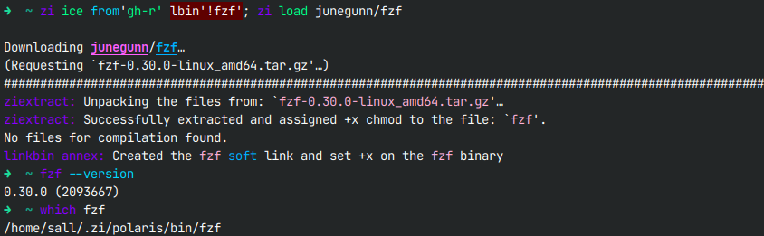

<table style="align:center;width:100%;height:auto">
<tr><td align="center">
  <h1>
    <a href="https://github.com/z-shell/zi">
      
    </a>❮ ZI ❯ Annex - LinkBin
  </h1>
<h2>Run programs and scripts without adding anything to <code>$PATH</code> via the automated <b>links</b> to <code>$ZPFX/bin</code>
</h2>
    
  </td>
</tr>
</table>

## Install

```shell
zi light z-shell/z-a-linkbin
```

## 💡 Wiki

- [annexes](https://z.digitalclouds.dev/docs/ecosystem/annexes)

## How it works

Exposing a binary program without modifying `$PATH` – `z-a-linkbin` will automatically create a hard or soft link to the binary in `$ZPFX/bin` exposing the program to the command line as if it were being placed in `$PATH`.

The command can then be accessed normally – not only in the live Zsh session, but also from any Zsh script.

The ice-modifier `lbin''` provided by the annex creates `links` for binaries and scripts.

It creates the `link` that calls the actual binary. The link is created always under the same, standard and single `$PATH` entry: `$ZPFX/bin`

> The optional preceding `!` flag means create a soft link instead of a hard link.

Example:

```shell
zi ice from'gh-r' as'program' lbin'!fzf'
zi load junegunn/fzf
```

Check the output:

```shell
ls -l $ZPFX/bin/ | awk '{print $(NF-2),$(NF-1),$NF}'
fzf --version
```

**The ice can contain globs**. It will expand these when searching for the binary.

Example:

```shell
zi ice from'gh-r' as'program' lbin'**fzf -> myfzf'
zi load junegunn/fzf
```

Check the output:

```shell
ls $ZPFX/bin
myfzf --version
```

**The ice can be empty**. It will then try to create the link:

- trailing component of the `id_as` ice, e.g.: `id_as'exts/git-my'` → it will check if a file `git-my` exists and if yes, create the link `git-my`,
- the plugin name, e.g.: for `paulirish/git-open` it'll check if a file `git-open` exists and if yes, create the link `git-open`,
- trailing component of the snippet URL,
- for any alphabetically first executable file.

Above also applies if just `!` were passed.

---

> This repository compatible with [ZI](https://github.com/z-shell/zi).

## Credits

Author: [NICHOLAS85](https://github.com/NICHOLAS85)
